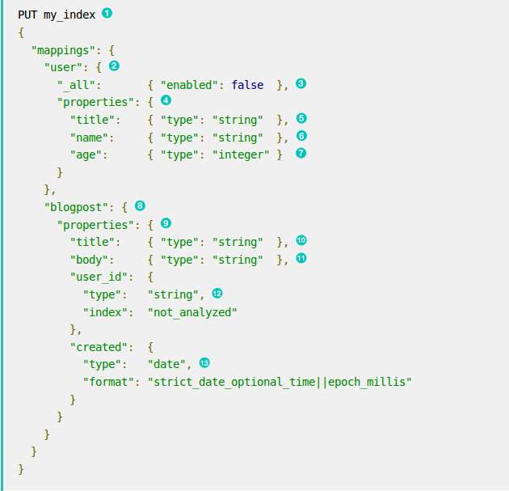
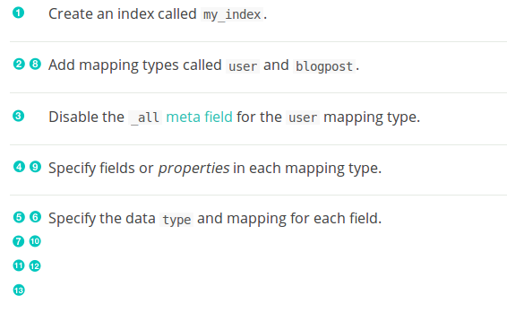

# 關於本文章

這是來自網路上的blog的文章的簡單筆記，主要說明elasticsearch與django的整合使用的一個例子，以便個人複習使用。

主要有四個部分
1. 建立django的骨架，特別是models.py內的內容。
2. 建指令，利用model-mommy套件生成資料庫資料
3. 建指令，映射elasticsearch，將資料送入elasticsearch
4. 完善django功能，urls->views->template. (這一部分有些複雜，也許分成二部分較好。)

## 建立django的骨架，並加上models.py
目前伺服器好像掛掉了。^^||

## 建立指令，以生成資料

Plan

    1. Create a command.
    2. Populate Universities.
    3. Populate Students.
    4. Populate Courses.
    5. Make a command reusable.


First, let's create a command via `django-extensions`

```
python project/manage.py create_command core
```
這將會在core資料夾下生成一個management資料夾，內有一個sample.py作為例子，把它執行看看。
```sh
python project/manage.py sample
```

```sh
File "/home/lee/mysb/el_django/project/apps/core/management/commands/sample.py", line 8, in handle
    raise NotImplementedError()
NotImplementedError
```
什麼～噴錯，進到sample.py看一下，才發現噴錯正常的，在def handle下讓它印點東西，再執行一次看看。

```python
 def handle(self, *args, **options):
     print('這是sample.py')
        #raise NotImplementedError()
```
你應該可以看到一些你的東西被印出來。把sample.py改名為dummy-data.py, 我們要用它來產生一些資料。

安裝model_mommy `pip install model_mommy`，我們要使用這個套件來把資料加到資料庫中。
把university加到資料庫的程式碼如下：
```python
from model_mommy import mommy
from django.core.management.base import BaseCommand
from core.models import University, Course, Student

class Command(BaseCommand):
    help = "My shiny new management command."

    def handle(self, *args, **options):
        print('這是sample.py')
        
        self.make_universities()
        #raise NotImplementedError()
    
    # 產生大學的資料
    def make_universities(self):
        university_names = (
            'MIT','MGU','CalTech','KPI','DPI','PSTU'
        )
        self.universities=[]
        
        for name in university_names:
            uni = mommy.make(University, name=name) # 這會將大學的名字塞到university的資料庫內。
            #由於名字的屬性是唯一的，因此再執行就會報錯。 
            #print(uni)
            #University model只有一個name欄位(字數255, unique)
            self.universities.append(uni) #把uni塞到universities
```
執行`python project/manage.py dummy-data`
```sh
System check identified some issues:

WARNINGS:
core.Student.courses: (fields.W340) null has no effect on ManyToManyField.
這是sample.py
(0.001) BEGIN; args=None
(0.001) INSERT INTO "core_university" ("name") VALUES ('MIT'); args=['MIT']
(0.000) BEGIN; args=None
(0.000) INSERT INTO "core_university" ("name") VALUES ('MGU'); args=['MGU']
(0.000) BEGIN; args=None
(0.000) INSERT INTO "core_university" ("name") VALUES ('CalTech'); args=['CalTech']
(0.000) BEGIN; args=None
(0.000) INSERT INTO "core_university" ("name") VALUES ('KPI'); args=['KPI']
(0.000) BEGIN; args=None
(0.000) INSERT INTO "core_university" ("name") VALUES ('DPI'); args=['DPI']
(0.000) BEGIN; args=None
(0.000) INSERT INTO "core_university" ("name") VALUES ('PSTU'); args=['PSTU']
```
可以看 handle函式被執行。

然後把製作courses的程式碼加進來。(自行查看程式碼)
再來是製作students的程式碼，這比較麻煩，得先安裝names(pip install names),然後也得動用到random來分配學校，最後還得將學生與課程連結在一起。在這裡要把xrange 改為range，不然會報錯。學生是使用mommy.perpare來製作資料，最後才用Student.objects.bulk_create()來一次製作。我們還得加入一個command-line option以指定要製作幾個學生。(請看add_arguments方法。)

在最一步時，我們需連結學生與課程, ForeignKeys的一個值並無法被知道，且我們無法插入一個列到一個表中當我們正在建立Students:ManyToMany course<-->student關係映射到資料表中時，表中須維持二個外鍵，一個在course表中，另一個在student表中，(見程式碼)如你可見，我們定義了"ThroghModel"的中間資料表，然為每個學生加上課程，這是統包插入，就像我們之前做過，課程的選擇是隨機的，這可能使得學生的選課有重覆，這會造成資料庫關係的錯誤，因此我們檢查'new course'是否已經被加到course_already_linked，假如有(重複)，就別加進去了，跳往下一個迴圈。

## 3rd Add data to the elasticsearch index in bulk, write a basic command, and add a mapping to the elasticsearch index.
Plan:

    1. Write a basic command.
    2. Add mapping to the elasticsearch index.
    3. Push all data to the index in bulk.
    4. Check results.
 
 這些是第三部分要做的事，寫一個指令，映射elasticsearch，把資料塞到elasticsearch，檢查結果。
 ###寫一個指令 push-to-index
 `cp dummy-data.py push-to-index.py` handle 方法留著，其他刪掉，然後讀一下elasticsearch 的mapping的文件。以下是說明文件的內容。
 mapping 是一個定義的程序，指明一個document及其所包含的fields，被儲存及索引。例如，使用mapping 以定義：
 
 * which string fields should be treated as full text fields. 
 * which fields contain numbers, dates, or geolocations. 
 * whether the values of all fields in the document should be indexed into the catch-all \_all field.
 * the format of date values.
 * custom rules to control the mapping for dynamically added fields. 
 Example mapping 
 


 
 
 一如Student是這個系統的一個主要實體，我們將在`core/models.py`中儲存mapping。（見程式碼）
 主要在class Meta:中作 mapping的描述。
 
 在此我們加上`es_index_name`,`es_type_name`與`es_mapping`到model中的Meta class中一個串列，這會禁止把任何東西都加到options，然而我不認為某人會想要使用`es_index_name`作為某個Django-models內的某個東西的名字。
 
 一如大部分的index fields 名稱是等同於models 內的fields，這應該對你而言是直觀的，我只將描述一部分。

* `university`: We plan to use this field in facets and filtering. We could've used `university_name` only, but we put it here as an object for two reasons; To mirror the fact it's really a distinct entity in the database, and to be able to show how to put an object to the mapping.
* `course_names`:Elasticsearch 並不需要指定array，我們只是把字串丟進來，其結果將會是字串。

然後我們把焦點轉向指令`push-to-index.py`的程式碼。
```python
from elasticsearch.client import IndicesClient
from django.conf import settings
from django.core.management.base import BaseCommand
from core.models import Student
class Command(BaseCommand):
    def handle(self, *args, **options):
        self.recreate_index()
    def recreate_index(self):
        indices_client = IndicesClient(client=settings.ES_CLIENT)
        index_name = Student._meta.es_index_name
        if indices_client.exists(index_name):
            indices_client.delete(index=index_name)
        indices_client.create(index=index_name)
        indices_client.put_mapping(
            doc_type=Student._meta.es_type_name,
            body=Student._meta.es_mapping,
            index=index_name
        )
 ```
 recreate_index方法做了幾件事。
 
 1. 建立`IndicesClient`實例，然後用這個實例的方法(indices_client.exists, indices_client.create, indices_client.put_mapping, indices_client.put_mappingindices_client.delete)來操作。
 2. 檢查`index_name`是否已存在，如果存在則予以刪除。
 3. 建立新的index
 4. Puts mapping to that index.

在執行之前你得安裝elasticsearch、requests套件，並且在settings中(project/conf/base.py)設定elasticsearch的連線。更進一步的elasticsearch設定，請看elasticsearch的api 文件。

此外為節省你的時間，作者使用了elasticsearch api 中的bulk helpers，來進行整批式的操作。此處的核心技術是轉換資料庫資料到json, 然後將json資料流到elasticsearch伺服器中。
首先更新指令，增加了二個方法--push_db_to_index, convert_for_bulk. convert_for_bulk是給push_db_to_index用的，convert_for_bulk直接使用了Student.objects.all()中的物件作為參數，然後執行物件的方法es_repr()並且使用了metadata來加以更新(這一步看不太懂，感覺上是python閉包的做法, 要找一下update的方法是哪來的? update方法，應該是字典物件自帶的方法，所以可以直接使用)。es_repr()方法主要是做為序列化使用(將資料字典化)。

## 4th Add functional frontend items, write queries, allow the index to update, and discuss a bonus tip. 

我們將在django view中使用elasticsearch, 下面是request-response。

```
                        template
                           |
                          \/
request -> url router -> view -> response
```
基於此，我們在3個地方加上程式碼。分別是
1. urls.py
2. views.py
3. templates/{template name}.html

在最後，我們將有一個具有「自動補全」的學生搜尋功能的網頁，具過濾的切面，並且有額外的學生細節。

首先，我們打開「開發用」伺服器。

然後，我們在url router上，加上一些邏輯。
```python
from core.veiws import autocomplete_view, student_detail, HomePageView

urlpatterns = [
    url(r'^admin/', admin.site.urls),
    url(r'^autocomplete/', autocomplete_view, name='autocomplete-view'),
    url(r'^student', student_detail, name='student-detail'),
    url(r'^$', HomePageView.as_view(), name='index-view'),
]
```
如你所見，我們加了三個新的urls,一個執行自動補全queries，一個取得student details，一個做為主頁。你可以看到shell有錯誤，這是正常的，因為core.views 還沒完成。讓我們把view完成。
```python
import json
from urllib.parse import urlencode #這裡要注意
from django.http import HttpResponse
from django.conf import settings
from django.shortcuts import render
from django.views.generic.base import TemplateView
from core.models import Student
#並且加上二個輔助的views

def autocomplete_view(request):
    query = request.GET.get('term','')
    resp = client.suggest(
        index='django',
        body={
            'name_complete': {
                "text": query,
                "completion": {"field": 'name_complete',}
            }
        }
    )
    options = resp['name_complete'][0]['options']
    data = json.dumps(
        [{'id': i['payload']['pk'], 'value': i['text']} for i in options]
    )
    mimetype = 'application/json'
    return HttpResponse(data, mimetype)

def student_detail(request):
    student_id = request.GET.get('student_')
    student = Student.objects.get(pk=student_id)
    return render(request, 'student-details.html', context={'student': student})
              
```
首先，`autocomplete_view`, return the json response 以使自動補全作用。
其次，自資料庫中將學生資料塞到`student-details.html template`然後繪出，並且包括html/css(在此不秀)
```python
class HomePageView(TemplateView):
    template_name = "index.html"
    def get_context_data(self, **kwargs):
        body = {
            'aggs':{
                'course_names': {'term':{'field': 'course_names', 'size':0}},
                'university_name':{'term':{'field': 'university.name'}},
                'year_in_school':{'term':{'field': 'year_in_school'}},
                'age':{'histogram':{'field': 'age', interval': 2}},
                # 'query': {'match_all':{}}
            }
            es_query = self.gen_es_query(self.request)
            body.update({'query': es_query})
            search_result = client.search(index='django', doc_type='student', body=body)
            context = super(HomePageView, self).get_context_data(**kwargs)
            context['hits'] = [
                self.convert_hit_to_template(c) for in search_result['hits']['hits']
            ]
            context['aggregations'] = self.prepare_facet_data(
                search_result['aggregations'],
                self.request.GET
            )
            return context
            
            def convert_hit_to_template(self, hit1):
                hit = deepcopy(hit1)
                almost_ready = hit['_source']
                almost_ready['pk'] = hit['_id']
                return almost_ready
                
            def facet_url_args(self, url_args, field_name, field_value):
                is_active = False
                if url_args.get(field_name):
                    base_list = url_args[field_name].split(',')
                    if field_value in base_list:
                        del base_list[base_list.index(field_value)]
                        is_active = True
                    else:
                        base_list.append(field_value)
                    url_args[field_name] = ','.join(base_list)
                else:
                    url_args[field_name] = field_value
                return url_args, is_active
                
            def prepare_facet_data(self, aggregations_dict, get_args):
                resp = {}
                for area in aggregations_dict.keys():
                    resp[area] = []
                    if area == 'age':
                        resp[area] = aggregation_dict[area]['buckets']
                        continue
                    for item in aggregations_dict[area]['buckets']:
                        url_args, is_active=self.facet_url-args(
                            url_args=deepcopy(get_args.dict()),
                            field_name=area,
                            field_value=item['key']
                        )
                        resp[area].append({
                            'url_args': urlencode(url_args),
                            'name': item['key'],
                            'count': item['doc_count'],
                            'is_activ': is_active
                        })
                    return resp
                
                def gen_es_query(self, request):
                    req_dict = deepcopy(request.GET.dict())
                    if not req_dict:
                        return {'match_all':{}}
                    filters = []
                    for field_name in req_dict.keys():
                        if '__' in field_name:
                            filter_field_name = field_name.replace('__','.')
                        else:
                            filter_field_name = field_name
                        for field_value in req_dict[field_name].split('.'):
                            if not field_value:
                                continue
                            filters.append(
                                {'term': {filter_field_name: field_value},}
                            )
                        return {
                            'filtered': {
                                'query': {'match_all': {}},
                                'filter': {
                                    'bool': {'must': filters}
                                }
                            }
                        }
     ```
這是CBV，HomePageView是TemplateView的子類化，HomePageView還包含了6個方法，分別是：
```python
def get_context_date(self, **kwargs):
def convert_hit_to_template(self, hit1):
def facet_url_args(self, url_args, field_name, field_value):
def prepare_facet_data(self, aggregations_dice, get_args):
def gen_es_query(self, request):
def get_sql_context(self):
```
這讓template的繪出更加容易。`template_name`類別屬性定義了要被使用的template的名字，你可以在`project/templates`資料夾內找到它。
讓我們一個一個描述方法：

* `get_context_data` 用以產出(`gen_es_query`)並執行 elasticsearch query, 並且準備在template被繪出的data(`prepare_facet_data` and `convert_hit_to_template`)
* `gen_es_query` 自GET-parameters產生elasticsearch filters
* `prepare_facet_data` 轉換elasticsearch aggregation dict以使容易呈現在template中，我們產生URL args 以使使用者能夠點選連結以增加或刪除過濾器，同時我們標記過濾器是否啟動，並留下計數。
* `convert_hit_to_template`自elasticsearch documents取出`_source`及primary key, 這是一種在template寫比較少的方法。

通常的工作流如下：
1. 使用者進入 index page.
2. 使用者點選一些過濾器
3. 使用者被重導向新的url，並伴隨一新的GET-parameters。
4. View 使用GET-parameters以產生新的query並輸出新的query results到template
5. 使用者檢視新的資料

你可能注意到了，頁面上所有的資料都是來自Elasticsearch，而不是直接來自資料庫 。

同時，一旦有人使用了在網頁右上角的「自動補全」欄位，並且點選了建議的學生，這將重導向學生細節網頁。我們在此使用了資料庫的資料。來自我之前的經驗，這會是相當手工的方式，去處理延遲(lag)，資料在資料庫更新且在搜尋索引中更新，我們必須記得elasticsearch是近乎即時的，但不完全即時，這樣的方式可以確保使用者看到正確的資料，即使搜尋索引中的版本已經過時了。
###確認索引是最新的，當一個新的資料被加入、更新或刪除。

在這個教學之前的部分，我們已經將資料整批次地塞到elasticsearch index。然而，所有的事務都是經常改變的，所以某些學生會更新他們的資料(更新課程、升上高一年級)，我們必須處理更新。我們有三個選擇：
1. 即時更新
2. 半即時更新
3. 週期性整批次更新


                
            
                